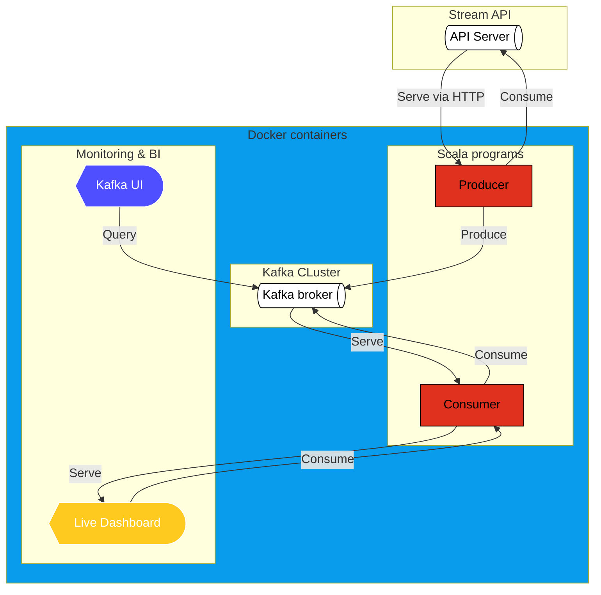

# data-stream

## Architecture

```mermaid
flowchart TB
  subgraph API [Stream API]
    APIServer@{ shape: h-cyl, label: "API Server" }
  end

  subgraph KafkaLayer [Kafka CLuster]
    KafkaBroker@{ shape: h-cyl, label: "Kafka broker" }
  end

  subgraph ScalaLayer [Scala programs]
    Producer
    Consumer
  end

  subgraph MonitoringLayer [Monitoring & BI]
    KafkaUI@{ shape: curv-trap, label: "Kafka UI" }
    Dashboard@{ shape: curv-trap, label: "Live Dashboard" }
  end

  subgraph Docker [Docker containers]
    ScalaLayer
    KafkaLayer
    MonitoringLayer
  end

  Producer -->|Consume| APIServer
  APIServer -->|Serve via HTTP| Producer
  Producer -->|Produce| KafkaBroker
  Consumer -->|Consume| KafkaBroker
  KafkaBroker -->|Serve| Consumer
  KafkaUI -->|Query| KafkaBroker
  Consumer -->|Serve| Dashboard
  Dashboard -->|Consume| Consumer

  style Docker fill: #099cec
  style KafkaBroker fill:#ffffff,stroke:#000000,color:#000000,stroke-width:1px
  style APIServer fill:#ffffff,stroke:#000000,color:#000000,stroke-width:1px
  style Producer fill:#df311e,stroke:#000000,color:#000000,stroke-width:1px
  style Consumer fill:#df311e,stroke:#000000,color:#000000,stroke-width:1px
  style KafkaUI fill:#4f4fff,stroke:#ffffff,color:#ffffff,stroke-width:1px
  style Dashboard fill:#feca1f,stroke:#ffffff,color:#ffffff,stroke-width:1px
```
